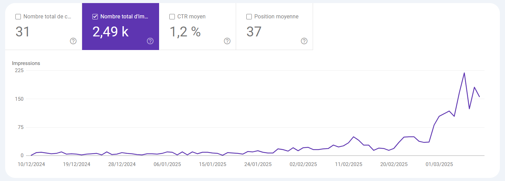

## Overview

This project aims to build an AI-powered agent that automatically creates blog posts to enhance SEO and significantly drive traffic to your website. As a practical example, I've been using this AI agent on my portfolio site for the past few weeks. Previously, my daily impressions were minimal (around 15 per day), but now they've increased dramatically to about 180 impressions per day, with a rapidly rising growth curve. While there's still room for improvement, we currently have a functional MVP ready to deliver meaningful results.

